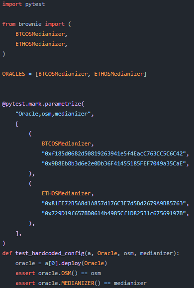

# Brownie简明教程


> 参考链接：
>
> [web3.py](https://web3py.readthedocs.io/en/stable/index.html)
>
> [eth-brownie](https://eth-brownie.readthedocs.io/en/stable/toctree.html)
>
> [Truffle vs Hardhat vs Brownie — Let’s have a look](https://mirabdulhaseeb.medium.com/truffle-vs-hardhat-vs-brownie-lets-compare-ea08b927d084)
>
> [yearn.finance](https://github.com/yearn/yearn-protocol)


## Brownie?

Brownie是一个基于Python的以太坊智能合开发和测试框架。

下面是Medium作者Mir AbdulHaseeb对于该框架的一些总结。

- 技术方面：Python、Web3.py、区块链分叉、Etherscan插件、Vype支持
- 区块链环境：Ganache/本地、测试网、主网
- 含测试框架
- 维护：非常积极
- 支持：积极
- 开源

对于我个人来说，Brownie的使用体验相较于Truffle和hardhat确实要更简洁。聚合器龙头YFI就是使用的Brownie框架，其中合约的测试仅需要用到Pytest和Brownie库就可完成全部编码。通过Python脚本完成智能合约的部署工作。

对于那些不习惯JavaScript进行合约测试的工程师，Brownie是最合适不过的了。



## 环境配置

### 依赖

- [python3](https://www.python.org/downloads/release/python-368/) version 3.6 or greater, python3-dev
- [ganache-cli](https://github.com/trufflesuite/ganache-cli) - tested with version [6.12.2](https://github.com/trufflesuite/ganache-cli/releases/tag/v6.12.2)
- pipx
- Microsoft Visual C++ 14.0

### pipx安装

```
python -m pip install --user pipx
python -m pipx ensurepath
```

### Brownie安装

```
pipx install eth-brownie
#安装完成后输入brownie验证是否安装成功
brownie --version
```

如果Brownie安装中出现"Microsoft Visual C++ 14.0 is required"可以参考此篇解决方案https://zhuanlan.zhihu.com/p/165008313

## 新建项目

### 创建一个空的项目

```
brownie init
```

### 从模板中构建项目

```
brownie bake token
```

更多模板请查看https://github.com/brownie-mix

### 项目结构

- `contracts/`: 合约文件
- `interfaces/`: 接口文件
- `scripts/`: 部署和交互脚本
- `tests/`: 测试脚本
- `build/`:编译后的文件和单元测试结果
- `reports`:GUI中使用的JSON报告文件

## 编译合约

brownie会编译所有在`contracts/`中存在的合约文件

```
brownie compile
```

## 合约交互

### 方法1-控制台

控制器与Python解释器十分类似，我们可以在控制台直接调用Python代码。

```
brownie console
```

### 方法2-运行脚本

除了console交互的方式，我们还可以使用[Brownie API](https://eth-brownie.readthedocs.io/en/stable/api.html)在`scripts/`中编写自动化脚本。

脚本样例：

```
from brownie import Token, accounts

def main():
    Token.deploy("Test Token", "TST", 18, 1e23, {'from': accounts[0]})
```


运行脚本：

```
#execute a script from the command line
brownie run <script>[function]

# executes the main() function within scripts/token.py
run('<script>')
```

## 脚本测试

测试脚本存储在`tests/`中，我们可以用以下操作完成测试

```
brownie test
```

## 扩展内容

### Brownie包管理

```
Brownie v1.17.2 - Python development framework for Ethereum

Usage: brownie pm <command> [<arguments> ...] [options]

Commands:
  list                          List available accounts
  install <uri> [version]       Install a new package
  clone <id> [path]             Make a copy of an installed package
  delete <id>                   Delete an installed package

Options:
  --help -h                     Display this message

Manager for packages installed from ethPM and Github. Installed packages can
be added as dependencies and imported into your own projects.

See https://eth-brownie.readthedocs.io/en/stable/package-manager.html for
more information on how to install and use packages.
```

brownie支持从ethPM和Github下载软件包并安装。

从Github安装 OpenZeppelin合约3.0.0:

```
#包标准：[ORGANIZATION]/[REPOSITORY]@[VERSION]
brownie pm install OpenZeppelin/openzeppelin-contracts@3.0.0
```

从ethPM安装:

```
#包标准：ethpm://[CONTRACT_ADDRESS]:[CHAIN_ID]/[PACKAGE_NAME]@[VERSION]
brownie pm install ethpm://defi.snakecharmers.eth:1/compound@1.1.0
```

安装到当前目录：

```
brownie pm clone OpenZeppelin/openzeppelin-contracts@3.0.0
```

### Brownie GUI

```
brownie gui #命令行
GUI() #控制台
```

### Accounts Container

进入控制台后，Brownie提供账户命令交互功能。常见的命令如下：

```
accounts(a/Accounts):列出本地账户
accounts[0]:第一个账户

#余额
accounts[1].balance():账户余额

#转账
accounts[0].transfer(accounts[1], "10 ether"):给accounts[1]转账。字符串可以指定单位，数值默认单位为wei

#添加
accounts.add()
accounts.add('<private_key>')
```
