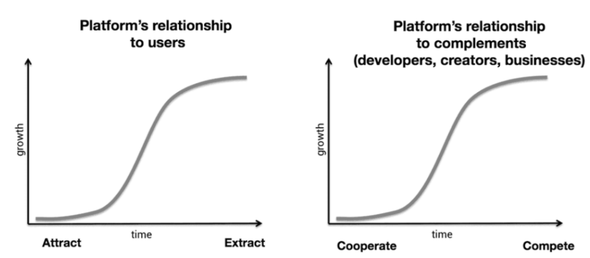

# Why Web3 Matters-为什么Web3如此重要？

> 原文链接：https://future.a16z.com/why-web3-matters/
>
> 作者：Chris Dixon

Web1（约为1990-2005）是一种关于非中心化和社区治理的开放协议。其绝大部分价值都集中在边缘网络—用户及构建者。

Web2（约为2005-2000）是由企业运营的孤立、去中心的服务。绝大部分的价值由谷歌、苹果、亚马逊、脸书等屈指可数的公司拥有。

我们现在正处于Web3的萌芽时期，它将web1中去中心化、社区治理的理念和web2中先进且现代的功能相结合。

Web3是由构建者与用户共同拥有的互联网，由令牌编织而成。(译注：一句话概括就是价值互联网)

那么为什么Web3如此重要呢？

首先，让我们来看看中心化平台的问题所在[Why decentralization matters](https://cdixon.org/2018/02/18/why-decentralization-matters)。

中心化平台遵循可预测的生命周期规律。最初，他们竭尽所能去招募用户和第三方，例如创建者、开发者和企业。

他们这么做是为了强化他们的网络效应。随着平台沿着S曲线上升，它们对用户及第三方的影响力稳步增长。

当平台到达顶峰后，他们与网络参与人群的关系，从正和走向零和。为了平台继续增长，需要去从用户中提取数据并与前合作者进行竞争。

关于这方面著名的例子有微软vs网景，谷歌vsYelp，脸书vsZynga，Twitter vs 第三方客户端，以及Epic vs 苹果。

对于第三方来说，从合作到竞争的过渡就像是一个引诱圈套。随着时间的推移，最优秀的一批企业级、研发者和投资者开始不在中心平台进行构建。这种现象抑制了创新。

回归正题，来谈谈web3。在web3中，所有权和控制权是去中心化的。用户和构建者可以通过代币（同质化和非同质化）来拥有部分互联网服务。

代币赋予用户财产权：拥有部分互联网的能力。

NFT让用户拥有自己的所有物，如艺术、照片、代码、音乐、文本、游戏、凭证、治理权、通行证等等人们梦寐以求的东西。

区块链作为一种特殊的计算机，任何人都可以访问，但没有人完全有用它。

以太坊以同质化代币作为动力，ETH，用于激励系统底层的物理机。ETH同事也是系统原生代币，用于交易，如购买NFT。

用户有很多途径可以购买同质化和非同质化代币。你可以购买，但也可以去赚取。

Uniswap协议因向早期用户空投15%治理代币而闻名。像这样的社区馈赠在web3中很普遍，作为一种建立信誉和激励采用的方式。

你可以通过创造和商业行为为获取代币。例如，人们每天售卖NFT赚取大约1亿美金。

代币使网络的参与者们共同努力朝同一个目标前进—网络的发展和代币的升值。

这种现象解决了中心化网络的核心问题，一家公司积累网络的价值，最终与它的用户和合作伙伴竞争。

在web3,之前，用户和构建者必须在web1有限的功能或者是web2团体和中心化的模式中选择。

Web3提供了一种新的方式，结合前时期最好的方面。现在是早期阶段，也是我们参与进入的最好时间。
